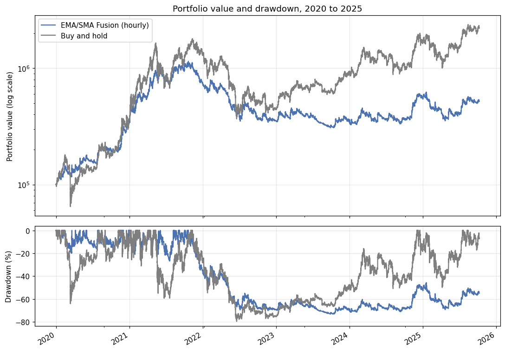
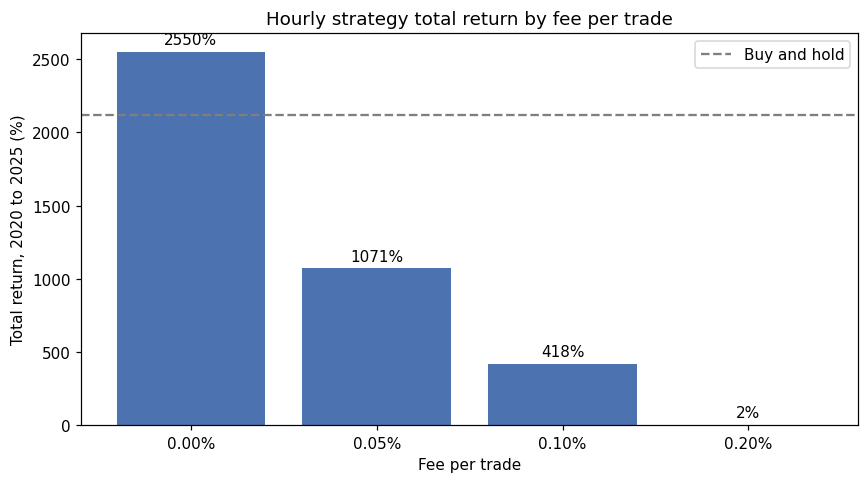
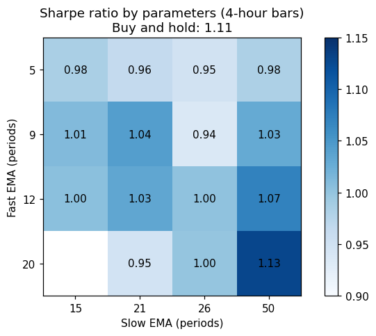

# EMA/SMA Fusion: Evaluating a Crypto Trend-Following Strategy

## Overview

The EMA/SMA Fusion strategy was developed for an algorithmic trading case study in my MSc programme as a systematic way to trade Bitcoin (BTC), Ethereum (ETH) and Ripple (XRP). It combines short-term momentum signals from exponential moving averages with a longer-term trend filter from a simple moving average. This repository evaluates whether the strategy outperforms buying and holding the same assets over 2020 to 2025 once realistic trading costs are included, and how robust that answer is.

## Strategy

The strategy buys when the 9-period EMA is above the 21-period EMA, the price is above the 50-period SMA, and the price is at least 0.5% above the slow EMA, a buffer intended to filter out false breakouts. It sells when the fast EMA falls below the slow EMA and the price falls below the SMA. The strategy was also deployed as an automated paper-trading bot on Alpaca from mid-2025 until March 2026.

## Data and Method

The analysis uses hourly closing prices for BTC, ETH and XRP from the Binance public API, covering 31 December 2019 to 8 October 2025 (50,547 hours per asset). The backtest, built with vectorbt, splits 100,000 in capital equally across the three assets, executes each signal at the close of the following bar to avoid look-ahead bias, and charges a 0.1% fee per trade. The benchmark holds the same equal-weighted portfolio throughout. Robustness checks vary the cost per trade, the timeframe (hourly, 4-hour and daily bars), the EMA parameters and the sample period.

## Key Findings

| | EMA/SMA Fusion (hourly) | EMA/SMA Fusion (daily) | Buy and hold |
|---|---|---|---|
| Total return | 418% | 912% | 2,120% |
| Sharpe ratio | 0.85 | 1.08 | 1.10 |
| Max drawdown | −73% | −61% | −80% |
| Trades | 2,428 | 105 | 3 |

The strategy does not outperform buy-and-hold after costs. On hourly data it trades about 2,400 times in under six years, and fees consume most of its gains: without costs it would have returned about 2,550%, beating buy-and-hold, but at a standard 0.1% fee it returns about 420%, and at 0.2% almost nothing.

On 4-hour and daily bars, turnover falls sharply and the strategy reaches a Sharpe ratio close to buy-and-hold's while cutting the maximum drawdown from about −80% to about −61%. These results hold across a wide range of EMA parameters, as the heatmap below shows, but no combination clearly beats buy-and-hold on a risk-adjusted basis. Splitting the sample shows a strong dependence on market regime: the strategy protected capital well through the 2022 bear market but captured under a third of buy-and-hold's gains during the 2023 to 2025 recovery.

## Correction of Earlier Results

An earlier version of this project reported a 5,216% return with a Sharpe ratio of 1.41. Those figures are not reproducible. The original backtest used vectorbt's `size_type='amount'`, which interprets the order size as a number of coins rather than a cash amount, and executed trades at the same closing price that generated each signal. This evaluation corrects both errors.

## Recommendations

The strategy should not be run on hourly bars, where costs outweigh the value of its signals; 4-hour or daily bars cut costs dramatically without reducing risk-adjusted performance. It is best used as a risk-management overlay for investors who want crypto exposure with shallower drawdowns, rather than as a way to beat the market. Before any real deployment, the timeframe and parameters should be validated through walk-forward testing on unseen data, slippage should be modelled alongside fees, and the live system should use exactly the parameters that were backtested. Volatility-based position sizing and a broader asset universe are natural extensions.

## Repository Contents

`ema_sma_strategy_evaluation.ipynb` contains the full evaluation, `download_btc.ipynb` shows how the price data was downloaded from Binance, and the `data` folder holds the hourly price files for BTC, ETH and XRP.

## How to Run

Install the dependencies with `pip install -r requirements.txt` and open `ema_sma_strategy_evaluation.ipynb` in Jupyter. No API keys are required.

## Tools

Python, pandas, NumPy, vectorbt, Matplotlib, the Binance API and Jupyter Notebook.
